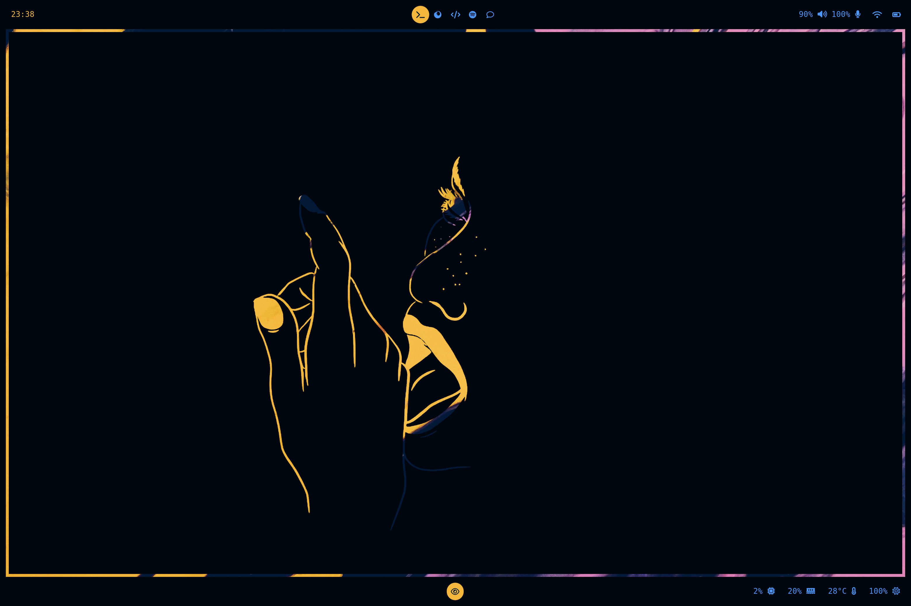
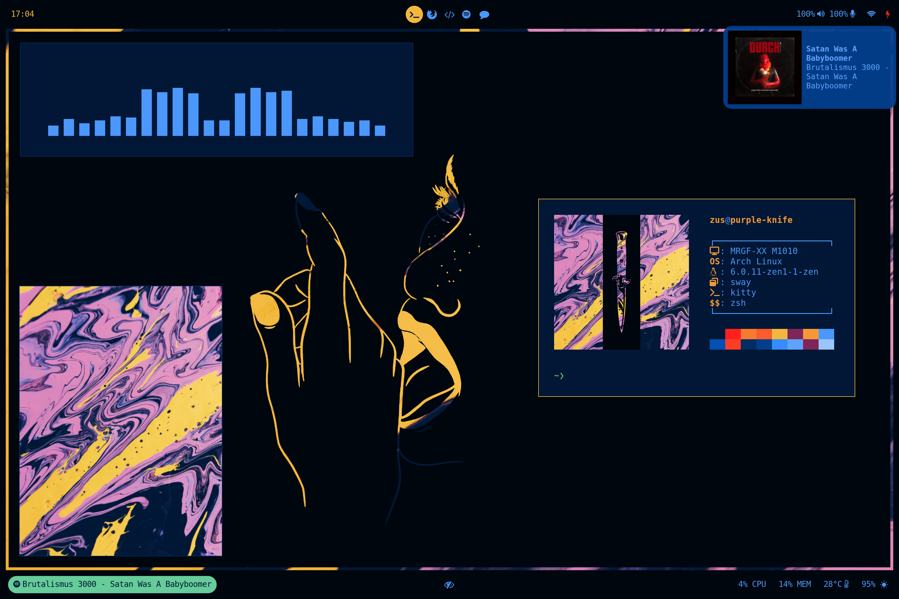
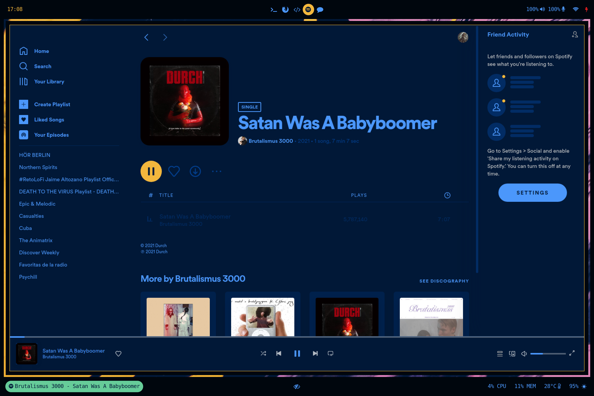
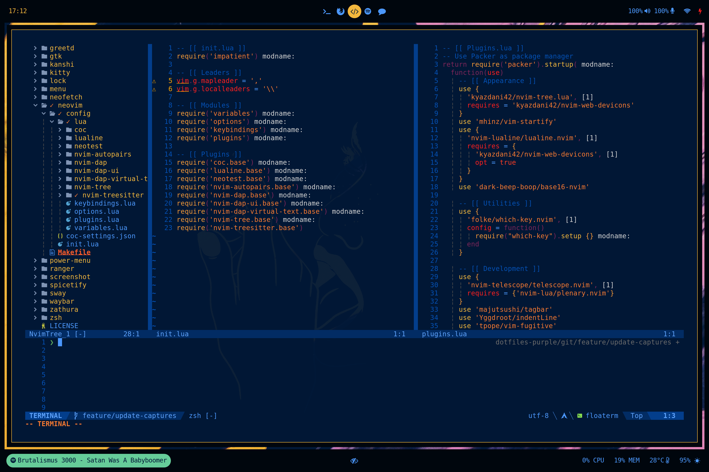
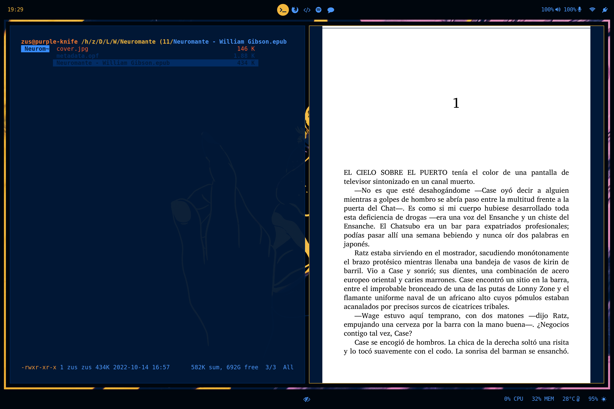
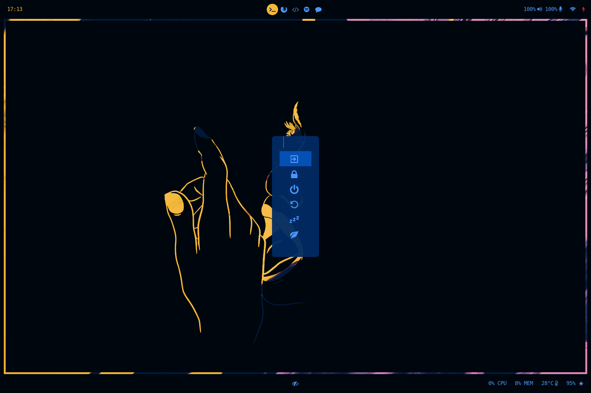
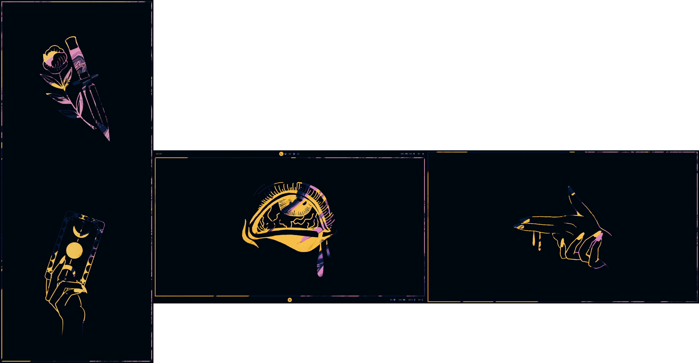

# dotfiles-logos
Configuration files for my personal laptop, with a custom color scheme based on the [base16](https://github.com/chriskempson/base16) themes.

## Some screenshots for showoff
### Simple setup
This is my usual setup, without external screens:

### Office setup
This setup has three displays with different orientations:

## Dependencies
This rice has been developed for Arch linux, but should be easy to adapt to some other distro. Here are some of the programs and packages I use and that the rice is created for and with. This list might not be updated, so be careful when using the rice as a reference.
- [sway](https://github.com/swaywm/sway)
- [waybar](https://github.com/Alexays/Waybar)
- [swaylock](https://github.com/mortie/swaylock-effects)
- [fuzzel](https://codeberg.org/dnkl/fuzzel)
- [greetd](https://git.sr.ht/~kennylevinsen/greetd)
- [wlgreet](https://git.sr.ht/~kennylevinsen/wlgreet)
- [kanshi](https://github.com/emersion/kanshi)
- [dunst](https://github.com/dunst-project/dunst)
- [flavours](https://github.com/Misterio77/flavours)
- [kitty](https://github.com/kovidgoyal/kitty)
- [bpytop](https://github.com/aristocratos/bpytop)
- [neofetch](https://github.com/dylanaraps/neofetch)
- [neovim](https://github.com/neovim/neovim)
- [ranger](https://github.com/ranger/ranger)
- [zathura](https://git.pwmt.org/pwmt/zathura)
- [zsh](https://github.com/zsh-users/zsh)
- [oh-my-zsh](https://github.com/ohmyzsh/ohmyzsh)
- [spotify](https://open.spotify.com/)
- [spicetify](https://spicetify.app/docs/advanced-usage/installation/)
- [cava](https://github.com/karlstav/cava)

## Attributions
Credit for the background abstract paintings:
 - [Dids](https://www.pexels.com/@didsss/)
